# Git

## 基本命令

**初始化一个Git仓库**

```bash
git init
```

**查看当前状态，有红色说明文件没有被跟踪**

```bash
git status
```

**添加所有文件到暂存区**

```bash
git add .
```

**提交暂存区的文件到本地仓库（参数`-m`后为当次提交的备注信息）**

```bash
git commit -m "提交信息"
```

**将本地的Git仓库信息推送上传到服务器**

```bash
git push origin 分支名
```

**列出所有本地分支**

```bash
git branch
```

**列出所有远程分支**

```bash
git branch -r
```

**创建新分支但停留在原分支**

```bash
git branch 分支名
```

**创建新分支并切换到新建分支**

```bash
git checkout -b 分支名
```

**合并指定分支到当前分支**

```bash
git merge 分支名
```

**删除分支**

```bash
git branch -d 分支名
```

**删除远程分支**

```bash
git push origin --delete 分支名
git branch -dr remote/分支名
```

------


## 忽略文件

当我们上传代码的时候，有些文件是不需要上传的，这时候我们就需要忽略一些文件，只上传需要的代码

***在主目录下新建 `.gitignore` 文件，此文件有如下规则：***

1.忽略文件中的空行或以井号（#）开始的行将会被忽略。
2.可以使用Linux通配符。例如：星号（*）代表任意多个字符，问号（？）代表一个字符，方括号（[abc]）代表可选字符范围，
大括号（{string1,string2.….}）代表可选的字符串等。
3.如果名称的最前面有一个感叹号（！），表示例外规则，将不被忽略。
4.如果名称的最前面是一个路径分隔符（/），表示要忽略的文件在此目录下，而子目录中的文件不忽略。
5.如果名称的最后面是一个略径分隔符（/），表示要忽略的是此目录下该名称的子目录，而非文件（默认文件或目录都忽略）。

```bash
#为注释
*.txt			#忽略所有.txt结尾的文件
!lib.txt		#但lib.txt除外
/temp			#仅忽略项目根目录下的TODO文件，不包括其他目录temp
build/			#忽略build/目录下的所有文件
doc/*.txt		#会忽略doc/notes.txt 但不包括 doc/server/arch.txt
```

------


## 使用（Gitee为例）

1. **新建仓库并配置信息**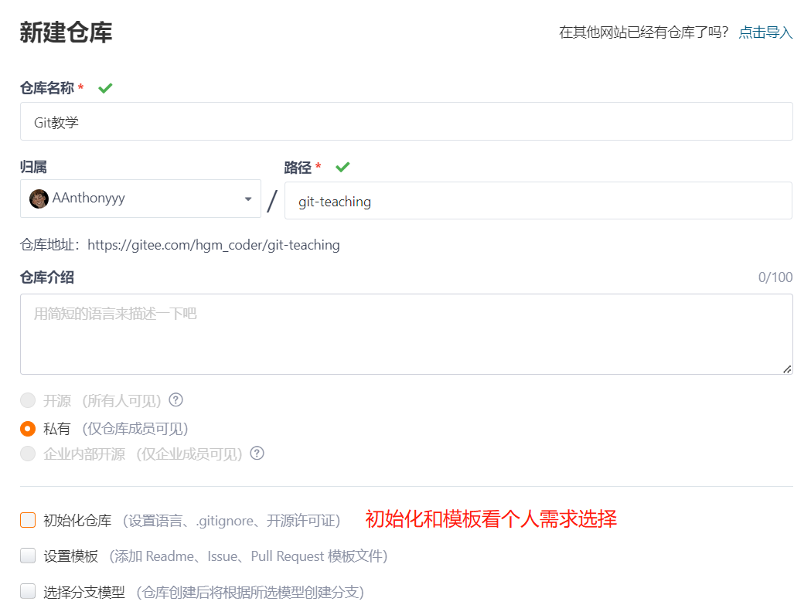

2. **选择合适的目录右键 Git Bash Here，在命令行输入克隆指令（最后是你想要的文件名字）**

   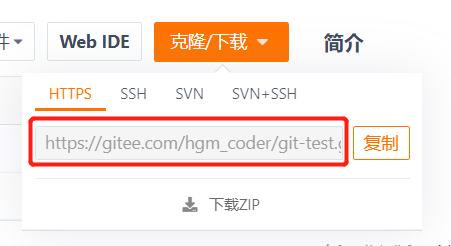

   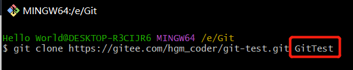

3. **克隆后出现文件夹，可以把你的东西存入此文件了**

   

4. **添加后上传到远程git仓库**

   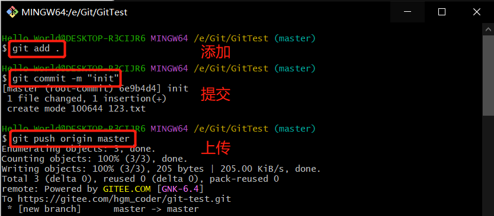

5. **然后打开git网站就能看到刚刚上传的东西了**

   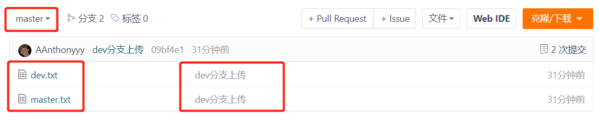

6. **如果需要创建其他分支的话**

   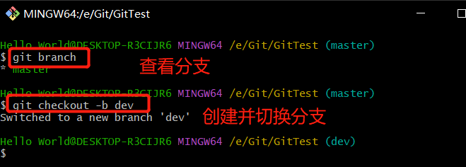

   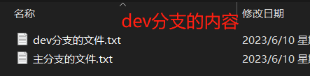

7. **添加好文件后正常提交到dev分支，随后切换到master分支对比，2个分支内容是不一样（前提先提交代码）**

   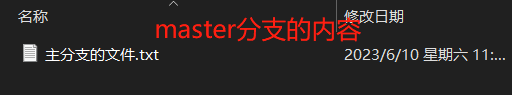

8. **提交后查看远程仓库的网站对比**

   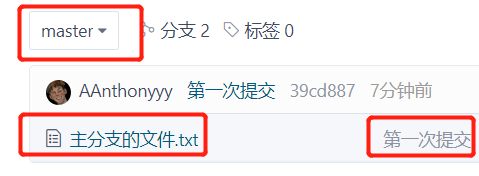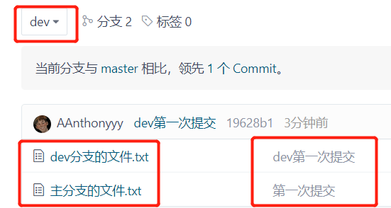

9. **合并分支，首先切换回master分支，按步骤直接提交即可**

   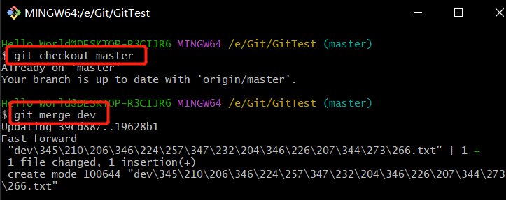

   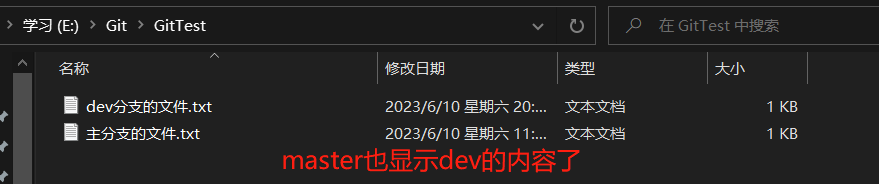

10. **如果把远程仓库的最新代码拉到本地的话**

    ```kotlin
    // 切换主分支
    git checkout master
    // 下拉
    git pull origin master
    // 再切换到dev分支
    git checkout dev
    // 合并
    git merge master
    （这样两个本地分支的代码都是最新的）
```

